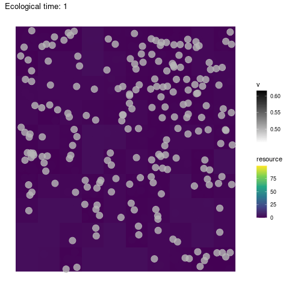
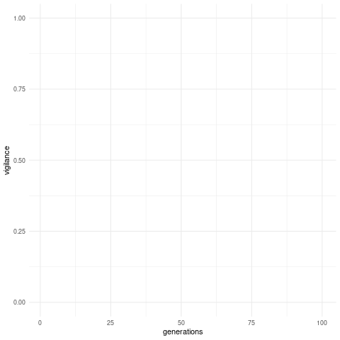

# anim-vigil
Creates animated gif plots for visualisation of vigilance-predation data.

## Visual example

Exploration                  | Trait evolution
:---------------------------:|:----------------------------:
 | 

## Installation

Simply download this repository and place wherever convenient on your machine.

## Requirements
This code was developped under Linux (Ubuntu 20.04.2 LTS) with R v4.0+. Rust and xdg-utils are required. To install on Ubuntu, run

```shell
sudo apt-get update -y
apt-get install cargo
apt-get install -y xdg-utils
```

## Usage

Create simulation output files with [Python code](https://github.com/ClaireGuerin/coding-challenge-hanno) or [C++ code](https://github.com/ClaireGuerin/vigilance-predation). The programs will create output text files with vigilance means over generation times (`vigilance_out.txt`), resources change (`resources_out.txt`) and individual movement (`exploration_out.txt`) over ecological time.

You can request visualization directly from the above programs if this repository is downloaded inside their root, or run the present R code `animate-sim.r` to obtain animated visualisations of the evolution of vigilance (`vigilance_out.gif`) and individual movement and resources on the grid (`grid_out.txt`).
